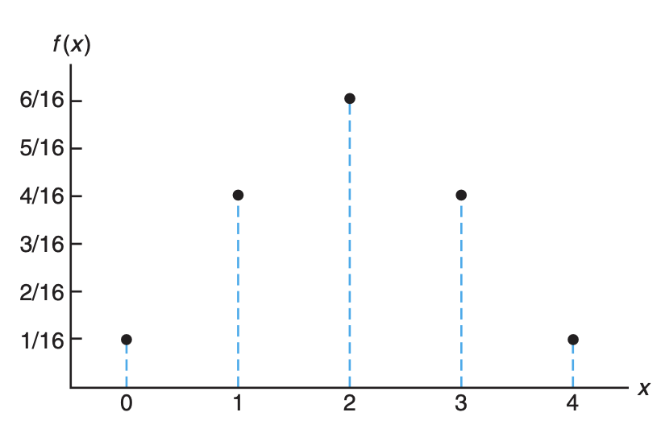
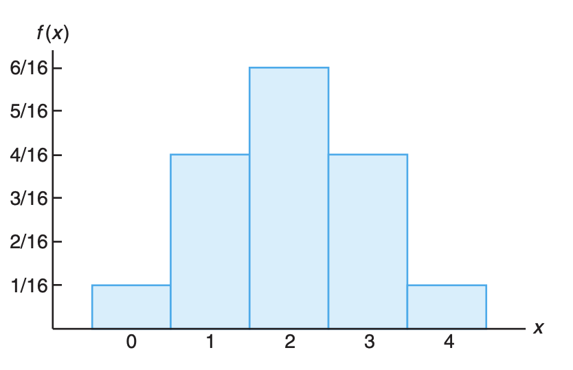
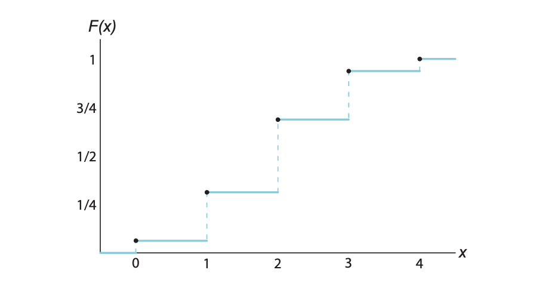
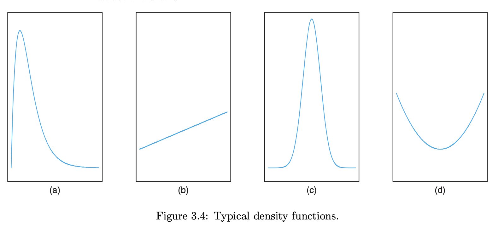
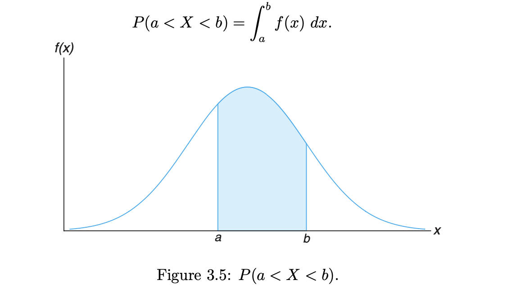

## ch 03 random variables and probability distributions

**contents**

1.  [concept of a random variable](#concept-of-a-random-variable)
    - [definition 3.1](#definition-31)
    - [example 3.1](#example-31)
    - [example 3.3](#example-33)
    - [example 3.5](#example-35)
    - [discrete random variable](#discrete-random-variable)
    - [continuous random variable](#continuous-random-variable)
    - [definition 3.2 discrete sample space](#definition-32-discrete-sample-space)
    - [definition 3.3 continuous sample space](#definition-33-continuous-sample-space)
2.  [discrete probability distributions](#discrete-probability-distributions)
    - [definition 3.4 probability mass function](#definition-34-probability-mass-function)
    - [example 3.6](#example-36)
    - [example 3.8](#example-38)
    - [example 3.9](#example-39)
    - [definition 3.5](#definition-35)
    - [example 3.10](#example-310)
    - [figure probability mass function plot](#probability-mass-function-plot)
    - [figure probability histogram](#probability-histogram)
    - [figure discrete cumulative distribution function](#discrete-cumulative-distribution-function)
3.  [continuous probability distributions](#continuous-probability-distributions)
4.  [probability density function](#probability-density-function)
5.  [joint probability distributions](#joint-probability-distributions)
6.  [definition of joint probability distribution / probability mass function](#definition-of-joint-probability-distribution--probability-mass-function)
-  [exercises](#exercises)

## concept of a random variable

- it is often important to allocate a numerical description to the outcome of a statistical experiment
- for a given sample space $S$ of some experiment, a random variable (rv) is any rule that associates a number with each outcome in $S$

### definition 3.1

**a random variable rv is a function that associates a real number with each element in the sample space**

- the function's domain is the sample space and it's range is the set of real numbers $\mathbb{R}$
- one and only one numerical value is assigned to each sample point x
- random variables are customarily denoted by upper case letters $X, Y, Z, \dots$
- we use lowercase letters to represent some particular value of the corresponding random variable
- the notation $X(\omega) = x$ means that $x$ is the value associated with the outcome $s$ by the rv $X$

### example 3.1

**two balls are drawn in succession without replacement from a box containing 4 red balls and 3 black balls.**

- the possible outcomes and the values y of the random variable Y, where Y is the number of red balls are

| sample space | y |
|:------------:|:-:|
|  RR          | 2 |
|  RB          | 1 |
|  BR          | 1 |
|  BB          | 0 |

**number of defective (D) products when 3 products are tested**

|sample space| x: values of X |
|:----------:|:--------------:|
| DDD        | 3              |
| DDN        | 2              |
| DND        | 2              |
| DNN        | 1              |
| NDD        | 2              |
| NDN        | 1              |
| NND        | 1              |
| NNN        | 0              |

### example 3.3 

**components from the production line are defective or not defective**

- define the random variable $X$ by

$$
f(x) = 
\begin{cases} 
        1, \text{ if the component is defective} \\
        0, \text{ if the component is not defective} \\
\end{cases}
$$

- this random variable is categorical in nature

### example 3.5
**a process will be evaluated by sampling items until a defective item is observed**

- define $X$ by the number of consecutive items observed

| sample space | x |
|:------------:|:-:|
| D            | 1 |
| ND           | 2 |
| NND          | 3 |
| ...          |  ... |

### discrete random variable

- according to the _countability_ of the sample space, which is measurable, it can be either discrete or continuous

- **discrete random variable** is a random variable whose sample space is discrete, if a random variable takes on only a countable number of distinct values
    - if the set of possible outcomes is countable
    - often this represents count data, such as the number of defectives, highway fatalities, etc.
-  a discrete random varibale assumes each of its values with a certain probability
-  frequently, it is convenient to represent all the probabilities of a random variable $X$ by a formula

$$f(x) = P(X = x), f(3) = P(X = 3)$$

### continuous random variable

- **continuous random variable** if a random variable can take on values on a continuous scale
    - often represents measured data, such as heights, weights, temperatures, distance, or life periods

### definition 3.2 discrete sample space

**discrete sample space**  if a sample space contains a _finite number of possibilities_ or an unending sequence with as many elements as there are whole numbers.

### definition 3.3 continuous sample space

**continuous sample space** if a sample space contains an _infinite_ number of possibilities equal to the number of points on a line segment.

### definition 3.4 probability mass function

**probability mass function** is the set of ordered pars $(x, f(x))$ is a probability function, probability mass function, or probability distribution of the discrete random variable $X$ if for each possible outcome $x$.

1.  $f(x) \geq 0$

2.  $\sum f(x) = 1$

3.  $P(X = x) = f(x)$

the probability distribution of a discrete random variable can be presented in the form of a mathematical formula, a table, or a graph-probability histogram, or barchart.

### example 3.6

let $X$ be the random variable:  number of heads in 3 tosses of a fair coin.

| sample space | x |
|:------------:|:-:|
| TTT          | 0 |
| TTH          | 1 |
| THT          | 1 |
| THH          | 2 |
| HTT          | 1 |
| HTH          | 2 |
| HHT          | 2 |
| HHH          | 3 |

the probability $P(X = x)$ that the outcome is a specific $x$ value is the probability that the number of heads is $x$.

| x | 0 | 1 | 2 | 3 |
|:-:|:-:|:-:|:-:|:-:|
| **$P(X = x)$** | 1/8 | 3/8 | 3/8 | 1/8 |

### example 3.8

-  a shipment of 8 similar microcomputers to a retail outlet contains 3 that are defective.  
-  if a school makes a random purchase of 2 of these computers
-  find the probability distribution for the number of defectives in the shipment

$$
f(0) = P(X = 0) = \frac{\binom{3}{0}\binom{5}{2}}{\binom{8}{2}} = \frac{10}{28} = 0.357 \\
$$
$$
f(1) = P(X = 1) = \frac{\binom{3}{1}\binom{5}{1}}{\binom{8}{2}} = \frac{15}{28} = 0.536 \\
$$
$$
f(2) = P(X = 2) = \frac{\binom{3}{2}\binom{5}{0}}{\binom{8}{2}} = \frac{3}{28} = 0.107 \\
$$

| x | 0 | 1 | 2 |
|:-:|:-:|:-:|:-:|
|**$f(x)$** | 10/28 | 15/28 | 3/28 |

### example 3.9

if a car agency sells 50% of its inventory of a certain foreign car equipped with side airbags, find the probability distribution of the number of cars with side airbags, find the probability distribution of the number of cars with side airbags, find the probability distribution of the number of cars with side airbags among the next 4 cars sold by the agency.

**solution** since the probability of selling an automobile with side airbags is 0.5, the $2^4 = 16$ points in the sample space are equally likely to occur.  therefore, the denominator is for all probabilities and also for our function it is 16.  in general, the event of selling x models with side airbags and $4 - x$ models without side airbags can occur in $\binom{4}{x}$ ways, where $x$ can be $0, 1, 2, 3,$ or $4$.  thus the probabability distribution $f(x) = P(X = x)$ is

$f(x) = \frac{1}{16}\binom{4}{x}$ for $x = 0, 1, 2, 3, 4$

$f(0) = \frac{\binom{4}{x}}{16} = \frac{1}{16}$

$f(1) = \frac{\binom{4}{x}}{16} = \frac{4}{16} = \frac{1}{4}$

$f(2) = \frac{\binom{4}{x}}{16} = \frac{6}{16} = \frac{3}{8}$

$f(3) = \frac{\binom{4}{x}}{16} = \frac{4}{16} = \frac{1}{4}$

$f(4) = \frac{\binom{4}{x}}{16} = \frac{1}{16}$

so the probability distribution is,

| x | 0 | 1 | 2 | 3 | 4 |
|:-:|:-:|:-:|:-:|:-:|:-:|
|**$f(x)$** | 1/16 | 1/4 | 3/8 | 1/4 | 1/16 |

### definition 3.5

**the cumulative distribution function** $F(x)$ of a discrete random variable $X$ with probability distribution $f(x)$ is

$$F(x) = P(X \leq x) = \sum_{t \leq x} f(t), \text{  for} -\infty \leq x \leq \infty$$

### example 3.10

find the cumulative distribution of the random variable $X$ in example 3.9 where $X$ is the number of cars with side airbags sold by the agency.

**example 3.9** probability distribution

| x | 0 | 1 | 2 | 3 | 4 |
|:-:|:-:|:-:|:-:|:-:|:-:|
|**$f(x)$** | 1/16 | 1/4 | 3/8 | 1/4 | 1/16 |

**probability distribution $f(x) = P(X = x)$**

$f(x) = \frac{1}{16}\binom{4}{x} , \text{  for  } x = 0, 1, 2, 3, 4 \\$

**discrete probability distribution**

-  $f(0) = \frac{1}{16}$

-  $f(1) = \frac{1}{4}$

-  $f(2) = \frac{3}{8}$

-  $f(3) = \frac{1}{4}$

-  $f(4) = \frac{1}{16}$

**cumulative distribution**

-  $F(0) = f(0) = \frac{1}{16}$

-  $F(1) = f(0) + f(1) = \frac{1}{16} + \frac{1}{4} = \frac{5}{16}$

-  $F(2) = f(0) + f(1) + f(2) = \frac{1}{16} + \frac{1}{4} + \frac{3}{8} = \frac{11}{16}$

-  $F(3) = f(0) + f(1) + f(2) + f(3) = \frac{1}{16} + \frac{1}{4} + \frac{3}{8} + \frac{1}{4} = \frac{15}{16}$

-  $F(4) = f(0) + f(1) + f(2) + f(3) + f(4) = \frac{1}{16} + \frac{1}{4} + \frac{3}{8} + \frac{1}{4} + \frac{1}{16} = 1$

**cumulative distribution $F(x) = P(X \leq x)$**

$$
F(x) = 
\begin{cases}
0, & \text{for  } x < 0 \\
1/16, & \text{for  } 0 \leq x < 1 \\
5/16, & \text{for  } 1 \leq x < 2 \\
11/16, & \text{for } 2 \leq x < 3 \\
15/16, & \text{for } 3 \leq x < 4 \\
1, & \text{for  } x \geq 4
\end{cases}
$$

now $f(3) = F(3) - F(2) = \frac{15}{16} - \frac{11}{16} = \frac{1}{4}$

### figure probability mass function plot

### figure probability histogram

### figure discrete cumulative distribution function

### continuous probability distributions

-  a continuous random variable has a probability of zero assuming exactly any of its values $P(a < X \leq b) = P(a < X < b) = P(a \leq X < b) = P(a \leq X \leq b)$

-  that is, it doesnt matter whether we include an exnd point of the interval or not, this is not true, though when $X$ is discrete.  although the probability distribution of a continuous random variable cannot be presented in tabular form, it can be stated as a formula.  such formula would be necessarily be a function of the numerical values of the continuous random variable $X$ and as such will be represented by the functional notation $f(x)$.  in dealing with continuous varibales $f(x)$ is usually called the **probability density function**, or simply the **desnity function** of $X$.

since $X$ is defined over a continuous sample space, it is possible for $f(x)$ to have a finite number of discontinuities.  however, most density functions have practical applications in the analysis of statsitical data are continuous and their graphs may take any several forms, some of which are shown below.

**example**  the height of a random person $P(X = 178\text{cm}) = 0$ with no assuming exactly

-  with continuous random variables we talk about the probability of x being in some interval, like $P(x < X < b)$

-  because areas will not be used to represent probabilities and probabilities are positive numerical values, the density function must lie entirely above the $x$ axis. 

### probability density function

a probability density function is constructed so that the area under its curve bounded by the $x$ acis is equal to $1$ when computed over the range of $X$ for which $f(x)$ is defined.  should this range of $X$ be a finite interval, it is always possible to extend the interval to include the entire set of real numbers by defining $f(x)$ to be zero at all points in the extended portions of the interval.  in the following figure below the probability that $X$ assumes a value between $a$ and $b$ is equal to the shaded area under the density function between th eordinates at $x = a$ and $x = b$, and from integral calculus is given by,

$$P(a < X < b) = \int_{a}^{b} f(x) dx$$ 

the function $f(x)$ is a **probability density function** (pdf) for the continuous random variable $X$, defined over the set of real numbers, if 

1.  $f(x) \geq 0$ for all $x \in R$
2.  $\int_{-\infty}^{\infty} f(x) dx = 1$
3.  $P(a < X < b) = \int_{a}^{b} f(x) dx$

### joint probability distributions

our study of random variables and their probability distributions in the preceding sections is restricted to one-dimensional sample spaces, in tha we recorded outcomes of an experiment as values assumed by a single random variable.  there will be situations, however, where we may find it desirable to record the simultaneous outcomes of several random variables.  for example we might measure the amount of precipitate $P$ and volume $V$ of gas released from a controlled chemical experiment, giving rise to a two-dimensional sample space consisting of the outcomes $(p, v)$, or we might be interested in the hardness $H$ and tensile strength $T$ of cold-drawn copper, resulting in the outcomes $(h, t)$.  in a study to determine the likelihood of success in college based on high school data, we might use the three-dimensional sample space and record for each individual his or her aptitude test score, high school class rank, and grade-point average at the end of freshman year in college.

if $X$ and $Y$ are two discrete random variables, the probability distribution for their simultaneous occurrence can be represented by the function with values $f(x, y)$ for any pair of values $(x, y)$ within the range of the random variables $X$ and $Y$.  it is customary to refer to this function as the **joint probability distribution** of $X$ and $Y$.  hence, in the discrete case...

$$f(x, y) = P(X = x, Y = y)$$

that is, the values $f(x, y)$ give the probability that outcomes $x$ and $y$ occur at the same time.

**example**

if an $18$-wheeler is to have its tired serviced and $X$ represents the number of miles these tires have been driven and $Y$ represents the number of tires that need to be replaced, then $f(30000, 5)$, is the probability that the tires are used over $30,000$ miles and the truck needs $5$ new tires.

### definition of joint probability distribution / probability mass function

$$f(x, y) = P(X = x, Y = y)$$

the function $f(x, y)$ is a joint probability distribution or **probability mass function** of the discrete random variables $X$ and $Y$ if

1.  $f(x, y) \geq 0$ for all $(x, y)$

2.  $\sum_{x} \sum_{y} f(x, y) = 1$

3.  $P(X = x, Y = y) = f(x, y)$

for any region $A$ in the $xy$ plane, $P[(X, Y) \in A] = \sum_{}\sum_{A} f(x,y)$

              
              
              
              

----------------------------------------
## exercises

**3.5, 3.7 3.13, 3.14, 3.17, 3.33, 3.36, 3.38, 3.41, 3.43, 3.45, 3.47, 3.56**

3.5.  determine the value of c so that each of the following functions can serve as a probability distribution of the discrete random variable x.

a.  $f(x) = x(x^{2} + 4)$, for $x = 0, 1, 2, 3$

b.  $f(x) = c\binom{2}{x}\binom{3}{3-x}$, for $x = 0, 1, 2$

knowing that the summation of a pdf is 1 always we we get the following template

$$
1 = \sum_{x} f(x)
$$

, and substituting the given expression for $f(x)$ and simplifying, we get:

$$
1 = \sum_{x=0}^2 f(x) = f(0) + f(1) + f(2) = c\binom{2}{0}\binom{3}{3-0} + c\binom{2}{1}\binom{3}{3-1} + c\binom{2}{2}\binom{3}{3-2} = c(1)(1) + c(2)(3) + c(1)(3) = 5c
$$

$$5c = 1 \implies c = \frac{1}{5}$$

therefore, the value of $c$ that makes $f(x)$ a probability distribution is $c = \frac{1}{5}$.

3.7.  the total number of hours, measured in units of 100 hours, that a family runs a vacuum cleaner over a period of one year is a continuous random variable $X$ that has a probability density function.  

$$f(x) = 
\begin{cases}
\end{cases}
$$

--------------------------------------------------------------------------------------

3.36  On a laboratory assignment, if the equipment is working, the density function of the observed outcome, X, is

$$f(x) = 
\begin{cases}
2(1 - x), & 0 < x < 1 \\
0, & \text{otherwise} \\
\end{cases}
$$

a.  calculate $P(X \leq \frac{1}{3})$

$$P(X\leq 1/3) = \int_{0}^{1/3} 2(1-x) dx = [2x-x^{2}] = \frac{2}{9}$$

b.  calculate $P(X > \frac{1}{2})$

$$P(X > 0.5) = \int_{0.5}^1 2(1-x) dx = 2x-x^2 = 0.25.$$

**3.38**  if the joint probability distribution of X and Y is given by f(x, y) = (x + y)/30, for x = 0, 1, 2, 3; y = 0, 1, 2, find P(X ≤ 2, Y = 1)

